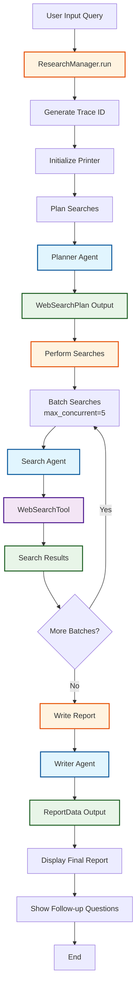
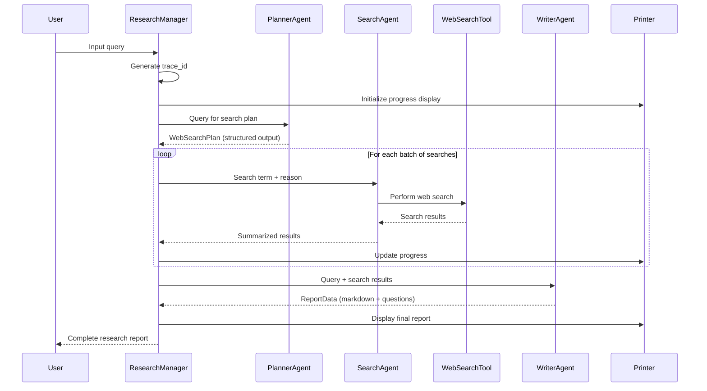

# Research Manager Flow Diagram



## Agent Interaction Flow



## Data Flow Architecture

```mermaid
graph LR
    subgraph "Input Layer"
        A[User Query]
    end
    
    subgraph "Planning Layer"
        B[Planner Agent]
        C[WebSearchPlan<br/>- searches: List[WebSearchItem]<br/>- reason: str<br/>- query: str]
    end
    
    subgraph "Execution Layer"
        D[Search Agent]
        E[WebSearchTool]
        F[Search Results<br/>List[str]]
    end
    
    subgraph "Synthesis Layer"
        G[Writer Agent]
        H[ReportData<br/>- short_summary: str<br/>- markdown_report: str<br/>- follow_up_questions: List[str]]
    end
    
    subgraph "Output Layer"
        I[Final Report]
        J[Follow-up Questions]
    end
    
    A --> B
    B --> C
    C --> D
    D --> E
    E --> F
    F --> G
    G --> H
    H --> I
    H --> J
    
    classDef inputClass fill:#e3f2fd,stroke:#1976d2,stroke-width:2px
    classDef planningClass fill:#f3e5f5,stroke:#7b1fa2,stroke-width:2px
    classDef executionClass fill:#e8f5e8,stroke:#388e3c,stroke-width:2px
    classDef synthesisClass fill:#fff3e0,stroke:#f57c00,stroke-width:2px
    classDef outputClass fill:#fce4ec,stroke:#c2185b,stroke-width:2px
    
    class A inputClass
    class B,C planningClass
    class D,E,F executionClass
    class G,H synthesisClass
    class I,J outputClass
``` 